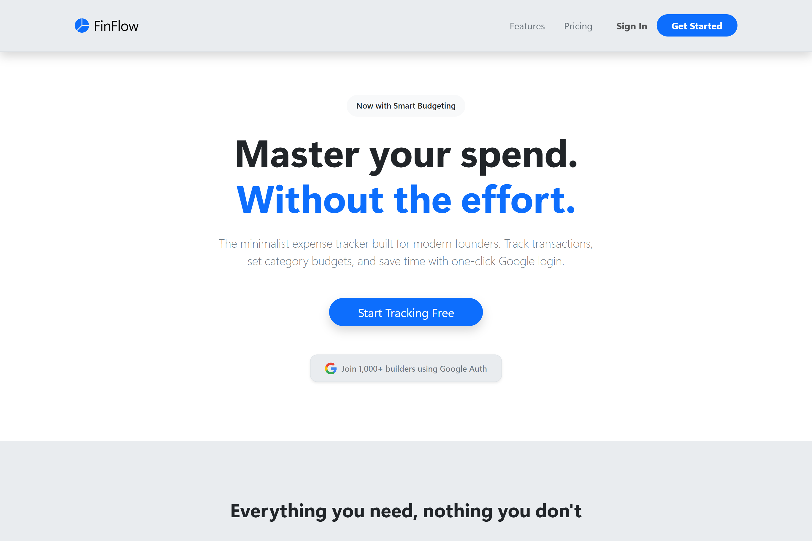
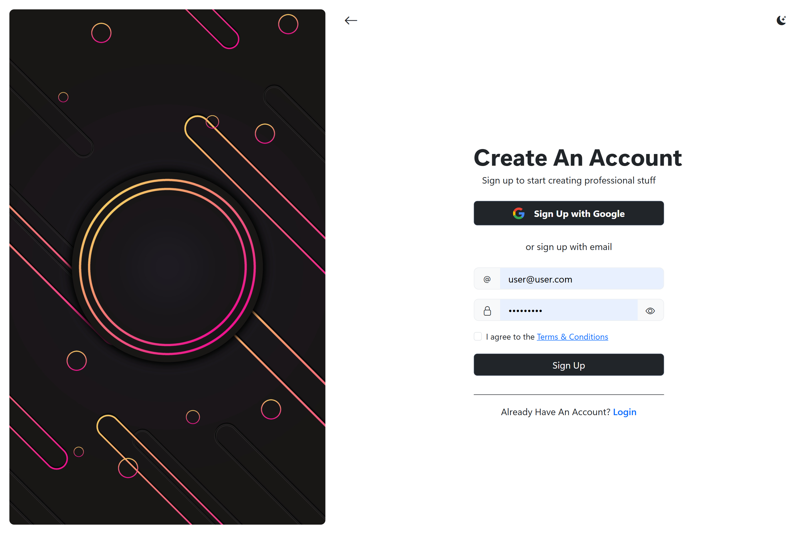
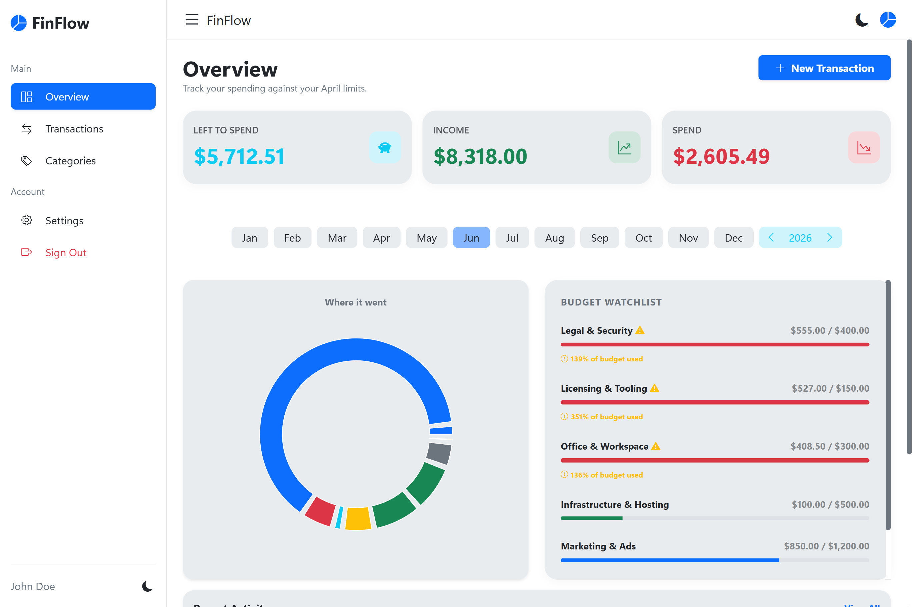
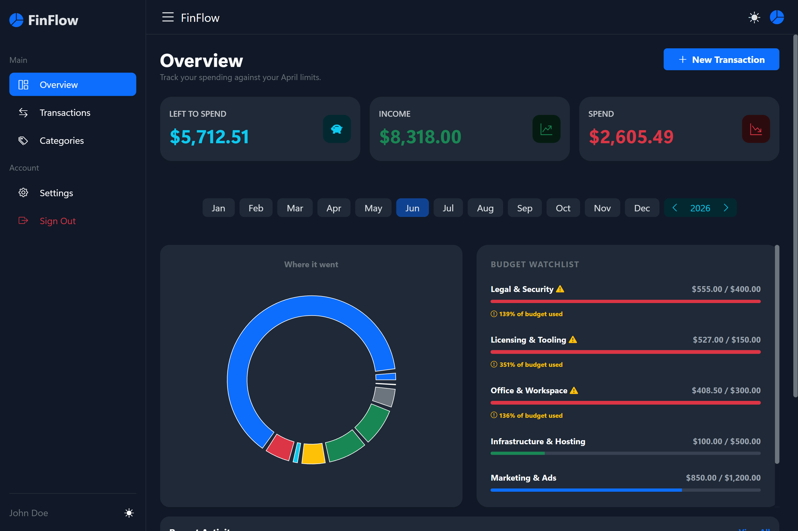
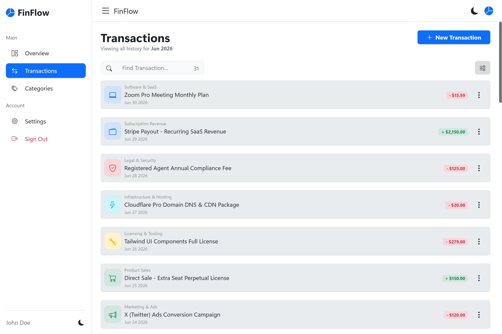
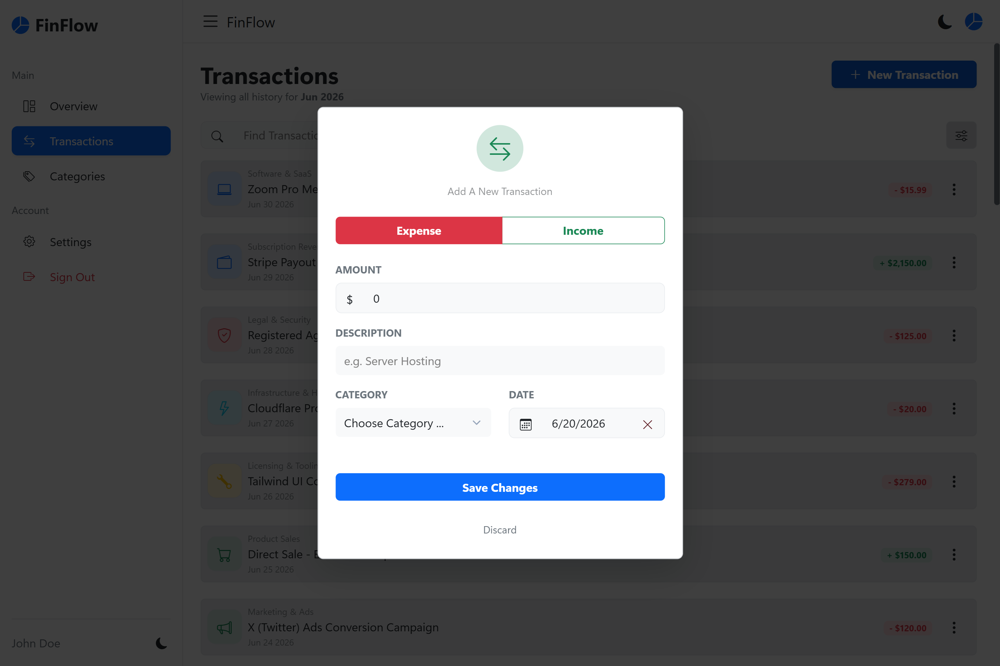
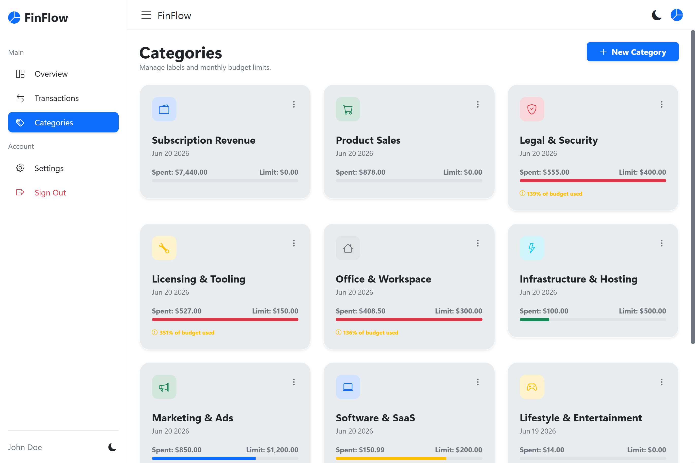

# 🚀 FinFlow – Expense Tracker

## 🧾 Project Overview

FinFlow is a modern web-based expense tracking application designed to help individuals manage their personal finances efficiently. It allows users to track transactions, categorize expenses, set budgets, and visualize spending habits through an interactive dashboard.

The app is built for users who want a simple but powerful way to control their finances without complexity.

---

## ❗ Problem It Solves

Managing personal finances is often scattered across notes, apps, or not tracked at all. This leads to:

* Lack of visibility into spending habits
* Difficulty staying within budget
* Poor financial decision-making

FinFlow centralizes all financial activity in one place, providing clear insights and control over spending.

---

## ✨ Features

* 🔐 User Authentication (Signup, Login, Password Reset)
* 📊 Dashboard with:

  * Summary cards (total spending, categories, etc.)
  * Spending visualization (pie chart)
  * Budget and limit tracking
* 💸 Transactions Management:

  * Create, update, delete transactions
  * Filter transactions by category/date
* 🗂️ Categories Management:

  * Create and manage categories
  * Assign budgets per category
* ⚙️ User Settings:

  * Profile management
  * Password update
  * Usage tracking
  * Data management
  * Account deletion
* 💳 Pricing Plans (2-tier system)
* 📱 Fully responsive design

---

## 🛠️ Tech Stack

* **Frontend:** React (Vite)
* **Styling:** Bootstrap
* **Backend Services:** Firebase

  * Authentication
  * Firestore (Database)
  * Hosting

---

## 🧱 Architecture & Structure

The project follows a modular and scalable structure:

```
src/
  components/     # Reusable UI components
  pages/          # Application pages (Dashboard, Transactions, etc.)
  hooks/          # Custom React hooks
  models/         # App Models
  styles/         # Custom CSS styles
  utils/          # Helper functions
  context/        # Global state management
```

This structure ensures maintainability and easy scalability for future features.

---

## 🔥 Key Highlights

* Reusable component-based architecture
* Custom hooks for logic separation
* Protected routes for authenticated users
* Real-time data handling with Firestore
* Clean and responsive UI design

---

## ⚔️ Challenges & Solutions

* **Managing real-time data efficiently**
  → Optimized Firestore reads and structured queries to reduce unnecessary calls

* **State management across multiple pages**
  → Implemented Context API and custom hooks for clean global state handling

* **Handling user-specific data securely**
  → Used Firebase Authentication with Firestore security rules

---

## 📸 Screenshots

### Landing Page



### Sign Up Page



### Dashboard Page



### Dashbaord Page (Dark)



### Transactions Page



### New Transaction Page



### Categories Page



---

## 🌐 Live Demo

https://finflow-expense-tracker.web.app

---

## 💻 GitHub Repository

https://github.com/shukri-alzoubi/finflow-expense-tracker

---

## 🚀 Future Improvements

* Add recurring transactions
* Email or push notifications for budget limits
* Export data (CSV/PDF)
* Advanced analytics (monthly trends, forecasts)

---

## ⚡ Performance Optimizations

* Dark mode support
* Optimized component rendering
* Efficient Firestore queries

---

## 🔒 Security Considerations

* Protected routes for authenticated users
* Firebase Authentication for secure access
* Firestore security rules to restrict user data access

---

## 📚 Lessons Learned

* Structuring scalable React applications
* Working with Firebase services in production
* Managing state and side effects effectively
* Designing user-focused financial dashboards

---
